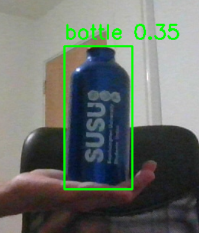

# Custom YOLOv8 Object Detector for Robotic Grasping

This project demonstrates a complete end-to-end pipeline for training a custom object detection model and using it for a simulated robotics task. A YOLOv8 model is fine-tuned to recognize a specific object (a blue bottle) in real-time using a webcam.

This project serves as the perception foundation for a future robotic grasping system.

<div align="center">
  
  <br />
  <em>Fig 1. The final custom-trained YOLOv8 model detecting a bottle in real-time.</em>
</div>

**Note:** You will need to take a screenshot of your `predict_yolo.py` script in action, name it `prediction_example.png`, and add it to your repository for the image above to display correctly.

## Project Pipeline

The project is divided into four main stages, representing a full MLOps cycle:

1.  **Data Collection:**
    * A custom dataset of ~50-100 images of the target object was captured using a standard camera, with variations in lighting, angle, and background.

2.  **Data Annotation:**
    * The open-source tool **Roboflow** was used to annotate the entire dataset. Bounding boxes were drawn around the target object in each image.
    * Roboflow was then used to generate a final dataset, automatically split into training, validation, and test sets and exported in the required **YOLOv8** format.

3.  **Model Training (`train_yolo.py`):**
    * **Transfer learning** was employed to fine-tune a pre-trained `yolov8n.pt` model on the custom dataset.
    * The model was trained for 50 epochs, with the `ultralytics` library managing the data loading, training loop, and validation.
    * The best-performing model weights were saved to a `best.pt` file.

4.  **Real-Time Inference (`predict_yolo.py`):**
    * A prediction script loads the custom-trained `best.pt` model.
    * It opens a webcam feed and runs the model on each frame in real-time.
    * The script draws bounding boxes, class labels, and confidence scores on the video feed for any detected objects.

## Technologies Used
* Python
* PyTorch
* Ultralytics YOLOv8
* OpenCV
* NumPy
* Roboflow (for annotation)

## How to Run

1.  **Clone the Repository and Set Up Environment:**
    ```bash
    git clone [https://github.com/YourUsername/YOLO-Grasping-Project.git](https://github.com/YourUsername/YOLO-Grasping-Project.git)
    cd YOLO-Grasping-Project
    conda create --name yolo-env python=3.9
    conda activate yolo-env
    pip install -r requirements.txt
    ```

2.  **Prepare Data:**
    * This repository does not include the training data. To train your own model, you must first collect and annotate your own images using a tool like Roboflow, then export the data in YOLOv8 format into a `dataset` folder.

3.  **Train the Model:**
    * With your `dataset` folder in place, run the training script. This is computationally intensive and will take time.
        ```bash
        python train_yolo.py
        ```

4.  **Make a Prediction:**
    * After training, a `best.pt` model file will be saved in the `runs/detect/train/weights/` directory.
    * Run the prediction script to test your custom model with a webcam.
        ```bash
        python predict_yolo.py
        ```
